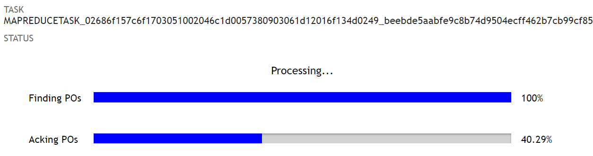

# netsuite-task-status
Retrieve and display the status of a NetSuite Map/Reduce task.



## Installation

1. Use the NetSuite file cabinet's Advanced Add button to upload the `task-status.zip` file from the latest github release.
Be sure to select unzip files.

2. Upload [react](https://unpkg.com/react@16.6.0/umd/react.production.min.js) and [react-dom](https://unpkg.com/react-dom@16.6.0/umd/react-dom.production.min.js) to the file cabinet.  Then create or edit the file `SuiteScripts/amdconfig.json` to tell NetSuite's script loader where to find react and react-dom.
```json
{
	"paths": {
		"react": "/path/to/react.production.min",
		"react-dom": "/path/to/react-dom.production.min"
	}
}
```

3. Create and deploy a suitelet script using the `task_status_sl.js` file uploaded in step 1.

## Usage

The simplest way to use the task status widget is to embed the suitelet in an iframe using an inline html field.

```javascript
var taskId = 'MAP_REDUCE_TASK_ID';
var suitelet = url.resolveScript({
    scriptId: 'customscript_task_status_sl',
    deploymentId: 'customdeploy_task_status_sl',
    params: {
        taskId: taskId,
        // request the UI widget instead of raw data
        widget: 1,
        // SuiteAnswers 68858
        ifrmcntnr: 'T',
        // rename the stages
        map: 'Finding POs',
        reduce: 'Acking POs',
        summarize: 'none'
    }
});

// add an ad hoc field to the form to contain the widget
var statusFld = form.addField({
    id: 'custpage_status_container',
    label: 'a',
    type: serverWidget.FieldType.INLINEHTML
});
statusFld.defaultValue = '<iframe src="' + suitelet + '" style="border:0;width:100%;height:200px;"></iframe>';
``` 

You can rename the progress bar for each stage using the `map`, `reduce`, and `summarize` query parameters.
You can hide the progress bar for a stage by passing the string `"none"`.
